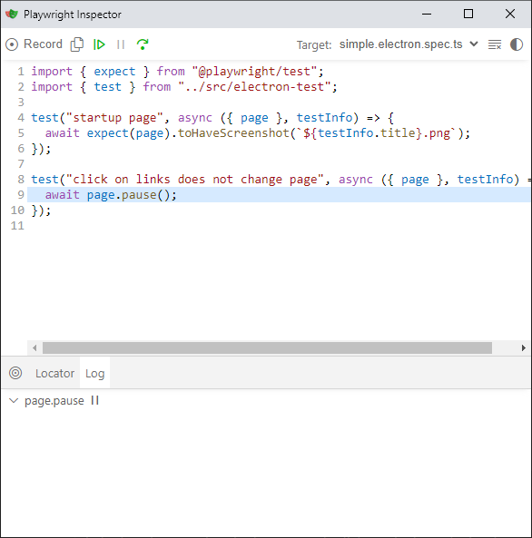
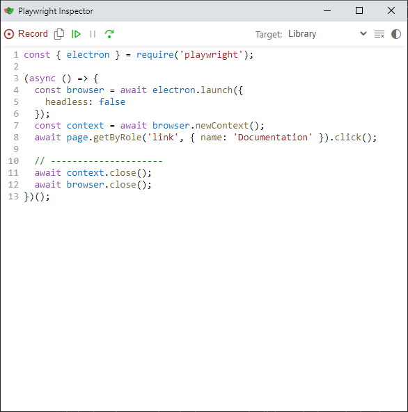

# Playwright e2e

- https://playwright.dev/docs/getting-started-vscode
- https://playwright.dev/docs/running-tests
- https://playwright.dev/docs/test-parameterize#parameterized-projects

## Codegen

- https://playwright.dev/docs/codegen

## Test Snapshots

- https://playwright.dev/docs/test-snapshots
- https://playwright.dev/docs/test-configuration#expect-options
- https://playwright.dev/docs/test-configuration#add-custom-matchers-using-expectextend

**Run specific test**

- `yarn playwright test -g "click on links does not change page"`

**Update specific test snapshots**

- `yarn playwright test -g "click on links does not change page" --update-snapshots`

## Electron

- https://playwright.dev/docs/codegen#record-using-custom-setup

### Codegen:

1. Add `await page.pause()` to test, existing or new test like this example:

```ts
test("click on links does not change page", async ({ page }, testInfo) => {
  await page.pause();
});
```

2. Run the `test`
3. Click on `Record`: 
4. Perform test steps: 
5. Copy newly created test steps from record window to `test` case and remove `await page.pause()`:

```ts
test("click on links does not change page", async ({ page }, testInfo) => {
  await page.getByRole("link", { name: "Documentation" }).click();
});
```

6. Write assertions (Screenshot comparison):

```ts
test("click on links does not change page", async ({ page }, testInfo) => {
  await page.getByRole("link", { name: "Documentation" }).click();
  await expect(page).toHaveScreenshot(`${testInfo.title}.png`);
});
```
